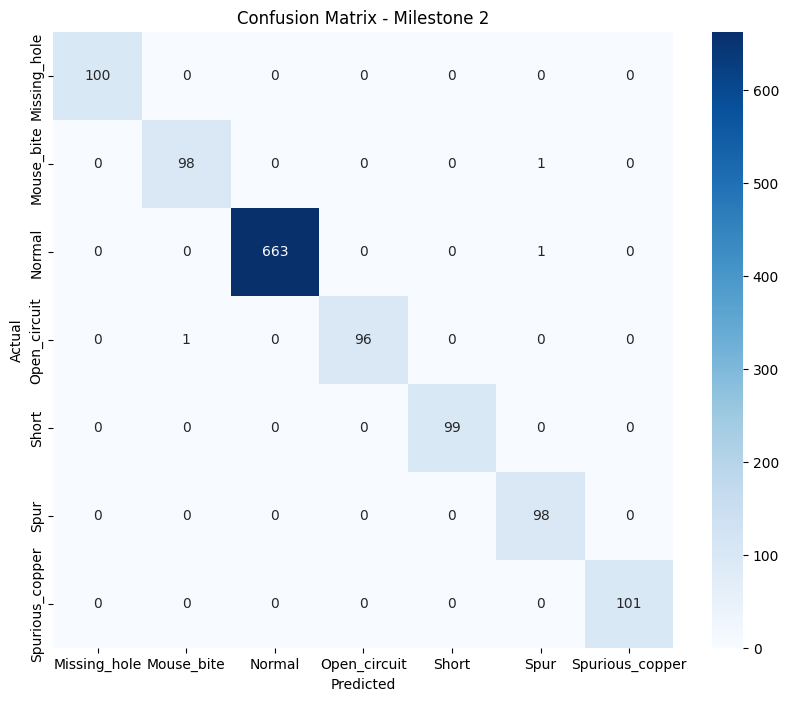
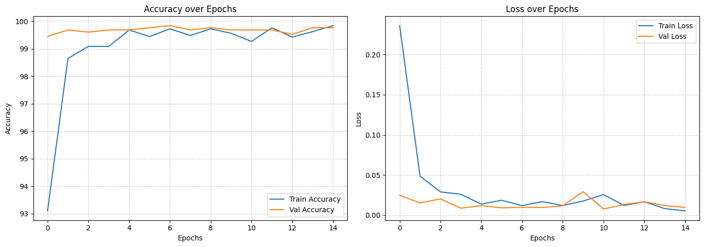

# Module 3: Model Training with EfficientNet

# Tasks Performed:

Neural Network Implementation: Built a classification model using PyTorch/Torchvision with an EfficientNet-B0 backbone.

Image Preprocessing: All defect images were resized to 128x128 pixels to maintain consistency and optimize training.

Data Augmentation: Applied techniques like Random Flips, Rotations, and Color Jittering to enhance model robustness and prevent overfitting.

Optimization Strategy: Trained the model using the Adam Optimizer and Cross-Entropy Loss for 15+ epochs.

---

# Deliverables:
✔️ Trained Model: Saved as pcb_final.pth.

✔️ Metrics: Training/Validation Accuracy and Loss logs.

✔️ Visualizations: Detailed accuracy plots and a comprehensive Confusion Matrix.

---

# Evaluation Benchmarks (Results)
Classification Accuracy: Achieved ≥ 95% accuracy on the test set.

Performance: Stable and repeatable training curves indicating a well-generalized model.

---
Visual Evidence:

  <h3>Module 3: Model Evaluation</h3>
  
  
<b>Confusion Matrix</b>

  
  
    

  
<b>Model Accuracy Graph</b>

  
  
  
<i>Note: The model achieved high accuracy on PCB defect detection using EfficientNet-B0.</i>

# Tech Stack
Framework: PyTorch (Deep Learning)

Vision: OpenCV (Preprocessing)

Analysis: Scikit-learn (Confusion Matrix & Reports)

---
